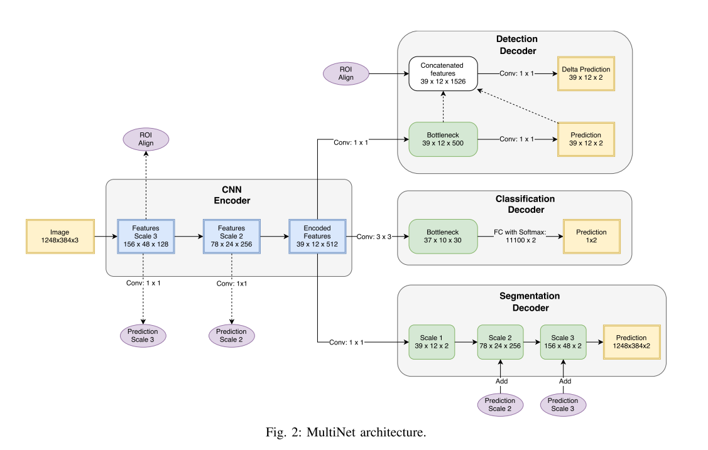

<!--
{"title": "MultiNet: Real-time Joint Semantic Reasoning for Autonomous Driving", "url": "https://www.repository.cam.ac.uk/bitstream/handle/1810/279403/iv18_root-compressed.pdf?sequence=1&isAllowed=y", "topics": "multi-task", "date": "2020-01-16", "estimated_minutes": "300"}
-->
### MultiNet: Real-time Joint Semantic Reasoning for Autonomous Driving

Read on: 2020-01-16  
Time spent: *5* hours  
Link to pdf: https://www.repository.cam.ac.uk/bitstream/handle/1810/279403/iv18_root-compressed.pdf?sequence=1&isAllowed=y  
Topic(s): `multi-task`

citation:
```
@inproceedings{Teichmann2018,
archivePrefix = {arXiv},
arxivId = {1612.07695},
author = {Teichmann, Marvin and Weber, Michael and Z{\"{o}}llner, Marius and Cipolla, Roberto and Urtasun, Raquel},
booktitle = {IEEE Intelligent Vehicles Symposium, Proceedings},
doi = {10.1109/IVS.2018.8500504},
eprint = {1612.07695},
isbn = {9781538644522},
mendeley-groups = {multi-task learning},
month = {dec},
pages = {1013--1020},
title = {{MultiNet: Real-time Joint Semantic Reasoning for Autonomous Driving}},
url = {https://www.repository.cam.ac.uk/bitstream/handle/1810/279403/iv18_root-compressed.pdf?sequence=1&isAllowed=y},
volume = {2018-June},
year = {2018}
}
```

### Abstract

__*What questions are the authors addressing?*__

1. Is it possible to do joint classification, detection and semantic reasoning with
a single neural network architecture?

2. Is this single neural network architecture faster computationally then doing
the tasks with distinct neural networks?

3. What influence does the joint architecture have on the performance of all
three tasks compared to doing them separately?

__*What is the major finding or scientific contribution?*__

The joint architecture can be trained end-to-end and performs well on the KITTI
dataset while also performing inference at 23 FPS.

__*What is the work's significance?*__

It shows that detection, semantic segmentation and classification can share
a feature space.  

### Materials and Methods

__*What is their experimental methodology or developed system?*__

There are 4 main components:

1. input encoder
2. classification decoder
3. detection decoder
4. segmentation decoder

which branches in the following way:



**Input encoder**

The input encoder is pre-trained on ImageNet. They have tried both VGG16 and a ResNet architecture.  

2 different VGG16 architecture were looked at:

1. VGG16-pool5, where they only used the convolutional part of VGG16 (removed the last 3 fully-connected layers)
2. VGG-fc7, where they use the whole network except for the last fully connected softmax layer. The 2 remaining fully connected layers were converted to 1x1 convolutions in order to make arbitrary input-size possible.

They also experimented with 2 ResNet implementations: the 50 layer and the 101 layer version of the network.
Both networks had the last fully-connected softmax layer removed

**Classification decoder**

2 different architectures:

1. A single huge fully-connected layer. Does not scale and therefore not used with large inputs.
2. A 1x1 conv layer with 30 channels called BottleNeck

**Detection Decoder**

I do not understand the details of the current detection architecture. It requires knowledge of previous work I should read first.

**Segmentation Decoder**

Similar upscaling as in FCN. Uses skip connections from input encoder.

**Training details**

To be written

__*If there are alternative approaches, how did they select this system?*__

They focused on this architecture to optimize inference speed for real-time
applications instead of focusing on the highest-possible accuracies.

__*What would I do differently?*__

I can't say yet.

### Results

__*What are the conclusions they draw from the data?*__


__*How do these results answer the greater question identified in the abstract?*__

__*Do the results lead to the final claims of the paper?*__

### Figures, Tables, and Data

__*What data set(s) were used?*__

In theory they use ImageNet to pretrain the encoder. In practice they take pretrained weights from someone else.

They use KITTI data for training.

__*Can you identify the results in the images/charts/graphs?*__

Results are split into:
1. separate training for each task (so just 1 loss)
2. jointly training each task (so 3 losses)

**Only segmentation**

Out of the 4 different encoders, resnet101 worked best on held-out val set.  
Using vgg-fc7 encoder on KITTI test set lead to top results in benchmark. (94.88% MaxF1, 93.71% AP)

**Only detection**

3 encoders + vgg no RIO pool are trained on the held out validation set. They also train Faster RCNN and evaluate on the validation set.

Compared to faster RCNN, the accuracy and inference speed of the vgg-pool5 encoder shows the most promise with higher accuracies on all three of the hard, moderate and easy object detection difficulties as well as inference speed of 26 fps vs 12 fps. The best accuracy is achieved by the resnet101 backbone but that backbone is also the slowest (but still faster than Faster RCNN). The worst accuracies are with vgg no RIO pool encoding but that does have the fastest inference (but only slightly faster than the way better performing vgg-pool5 encoder)

**Only classification**

The ResNet backbone + classification architecture has higher accuracy than the baseline "vanilla" vgg16 or resnet implementation. Resnset101 backbone has best
accuracy.

**Joint results**

VGG pool5 has the best trade off between accuracy and speed.

Classification:

joint:


distinct classification:


distinct detection:


distinct segmentation:


We can see that....

__*What are the controls in the experiments and have they presented them properly?*__

There is no clear comparison of the joint results versus the non-joint (control)
results as well as no comparison to the baseline results.

### Conclusions/Discussion

__*What do the results mean?*__

__*Can you think of other interpretations of their results?*__

__*How would I interpret the data?*__

__*Are there any other implications based on this work?*__

### Additional notes or thoughts

The PDF at https://www.repository.cam.ac.uk/bitstream/handle/1810/279403/iv18_root-compressed.pdf?sequence=1&isAllowed=y is better than the arxiv URL https://arxiv.org/abs/1612.07695.

What does it mean to do classification on a huge image with many different objects? They just detect road type (or road/no road)

#### Future reading

RoI align [21]  
Yolo and OverFeat ReInspect [54]  
Yolo [45]  
Overfeat [51]  
FCN [35]  
MaxF1/road benchmark [12]  
Average precision score [11]  
KITTI Vision Benchmark Suite [14]  
Modnet: Moving object detection network [52]  
Kitti road public benchmark [13]  
Residual network [22]
detection:
 region proposal [31, 24, 25], [18, 46],
 cnn region proposal: [10, 46]
 3d region proposal: [6, 5]
 direct end-to-end: [51, 33, 54, 33]

 segmentation:
 all mentioned papers in related work are potential

MTL:
all metnioned papers in related work are potentially interesting
